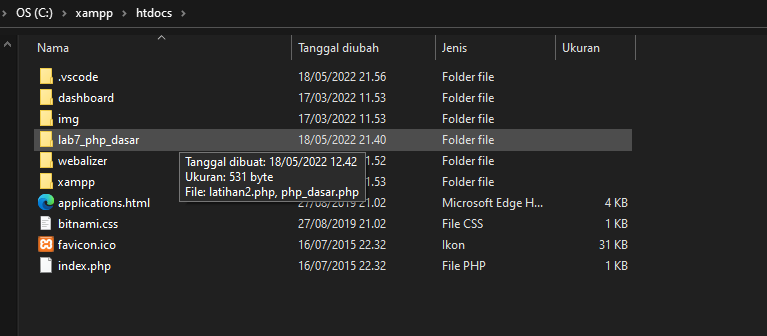

# Lab7Web

# Nama  : Ibnu Fajar
# NIM   : 312010420
# Kelas : TI. 20. A1

**Langkah-langkah Praktikum** 
Untuk memulai membuat kode php, perlu disiapkan web server dan interpreter PHP terlebih dahulu. Web servar yang kita gunakan adalah Apache 2 dan interpreter PHP 7. Untuk memudahkan proses praktikum, kita gunakan aplikasi bundle web server yaitu XAMPP. 

**Instal XAMPP** 
Unduh XAMPP dari *https://www.apachefriends.org/download.html* dan pilih versi portable untuk memudahkan proses installasi. Kemudian extract file tersebut, seusikan direktorinya (misal: d:\xampp) 

**Menjalankan Web Server** 
Untuk menjalankan web server dari menu XAMPP Control 
 

**Memulai PHP** 
Buat folder *lab7_php_dasar* pada root directory web server (d:\xampp\htdocs) 
 
Kemudian untuk mengakses direktory tersebut pada web server dengan mengakses URL: *http://localhost/lab7_php_dasar/* 
 

**PHP Dasar** 
Buat file baru dengan nama **php_dasar.php** pada directory tersebut. Kemudian buat kode seperti berikut. 
 
Kemudian untuk mengakses hasilnya melalui URL: *http://localhost/lab7_php_dasar/php_dasar.php*
 

**Menambahkan Variable** 
 
 

**Predefine Variable $_GET**

